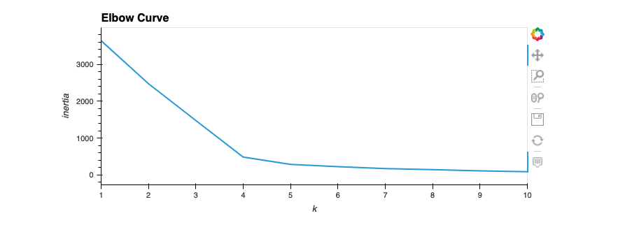
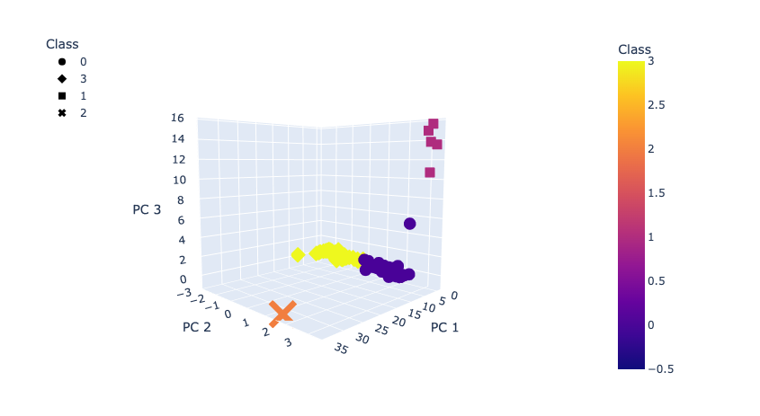
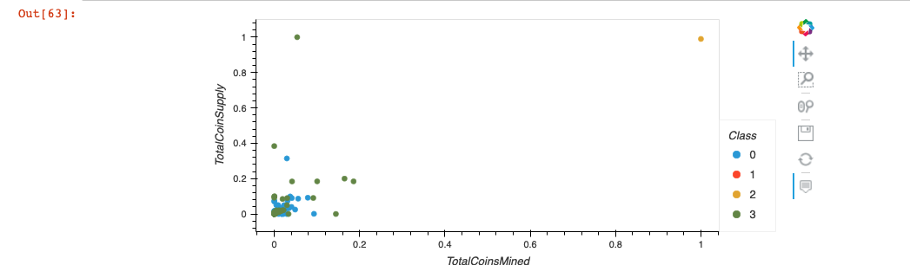

# cryptocurrencies

In this assignment, an investment bank is looking to offer a new cryptocurrency investment portfolio for its customers. I created a report that includes what cryptocurrencies are on the trading market and how they could be grouped to create a classification system for this new investment. 

I first processed the crypto data to fit the machine learning models. Since there is no known output, we used unsupervised learning. 

## Results
The following images are the data visualization tables after preprocessing the data for PCA, reducing data dimensions with PCA and clustering using K-means.

### First I create an elbow curve to determine the best value for K-means:

As you can see here, the curve slows at 4. We use k=4 to run K-means.

### After running the K-means model, I visualized the PCA data and clustering in a 3D model:

Here we can see the four cluster groups we created using K-means. 

### Finally, I scaled the data to create a plot with tradable cryptocurrencies:

The cryptocurrency with the highest total coins mined and the highest total coins supply is BitTorrent, represented as the yellow point in the upper right hand corner.  
